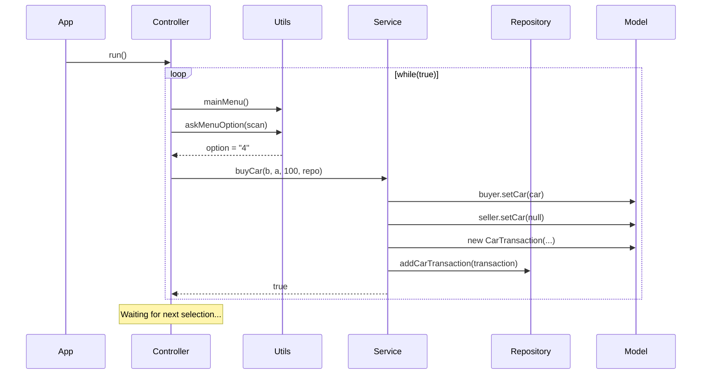

# use case buyCar

## Flow buyCar

> Here’s the flow for the use case `buyCar` with all operations being successful, so the user picks option #4 and both people can make the deal because the car exists.:

1. `App.main` → `Controller.run()`
2. Inside the loop: `Utils.mainMenu()` + `Utils.askMenuOption(scan)`
3. User chooses 4 → `Service.buyCar(b, a, 100, repo)`
4. Inside `buyCar`: the transfer  
   `buyer.setCar(car)` + `seller.setCar(null)`
5. Creation of the `CarTransaction` object
6. Add the `CarTransaction` object to repo: `repo.addCarTransaction(transaction)`
7. return buyCar: `true`
8. The `controller` keeps the `while(true){}` working
9. Inside the loop: `Utils.mainMenu()` + `Utils.askMenuOption(scan)`
10. User must select option another time
11. Waiting ...  

## Project Structure Tree

```
src/
└── main/
    └── java/
        └── org/
            └── example/
                ├── App.java
                ├── controller/
                │   └── Controller.java
                ├── model/
                │   ├── Car.java
                │   ├── CarTransaction.java
                │   ├── Dog.java
                │   └── Person.java
                ├── repository/
                │   └── Repository.java
                ├── service/
                │   └── Service.java
                └── utils/
                    └── Utils.java
```

## Sequence UML Diagram

