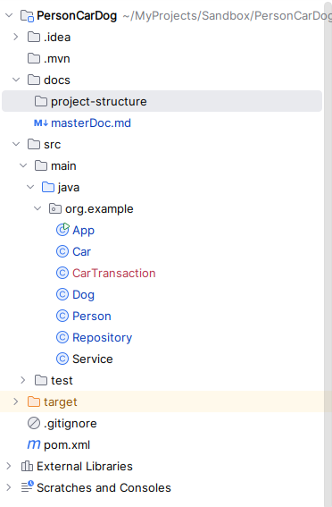

# masterDoc v1

## Summary

A console-based Java application for managing **Person**, **Car**, and **Dog** entities with support for car transactions between people. The application provides a menu-driven interface for CRUD operations and uses an in-memory repository for data storage.

## Project

- **Name:** PersonCarDog
- **Package:** `org.example`
- **Entry point:** `App.main()`
- **Build:** Maven (`pom.xml`)
- **Version:** 1.0-SNAPSHOT

Project structure:



## Classes

| Class | Fields | Description |
|---|---|---|
| **App** | — | Main class with console menu loop |
| **Person** | `id`, `name`, `age`, `car` | Represents a person who can own a car |
| **Car** | `id`, `make`, `model`, `year` | Represents a car |
| **Dog** | `id`, `name`, `breed`, `age` | Represents a dog |
| **CarTransaction** | `id`, `buyer`, `seller`, `date`, `car`, `contract` | Records a car sale between two people |
| **Service** | — | Business logic (e.g. `buyCar`) |
| **Repository** | `id`, `people`, `cars`, `dogs`, `carTransactions` | In-memory data store with CRUD methods |

## UML

```
┌─────────────────┐       ┌─────────────────┐
│    Person       │       │     Car         │
├─────────────────┤       ├─────────────────┤
│ - id: String    │       │ - id: String    │
│ - name: String  │       │ - make: String  │
│ - age: int      │       │ - model: String │
│ - car: Car      │──────>│ - year: int     │
└──────┬──────────┘       └─────────────────┘
       │
       │ buyer / seller
       ▼
┌─────────────────────┐
│   CarTransaction    │
├─────────────────────┤
│ - id: String        │
│ - buyer: Person     │
│ - seller: Person    │
│ - date: Date        │
│ - car: Car          │──────> Car
│ - contract: String  │
└─────────────────────┘

┌─────────────────┐
│     Dog         │
├─────────────────┤
│ - id: String    │
│ - name: String  │
│ - breed: String │
│ - age: int      │
└─────────────────┘

┌─────────────────────┐       ┌─────────────────────────┐
│      Service        │       │     Repository          │
├─────────────────────┤       ├─────────────────────────┤
│ + buyCar(...)       │       │ - people: List<Person>  │
└─────────────────────┘       │ - cars: List<Car>       │
                              │ - dogs: List<Dog>       │
                              │ - carTransactions:      │
                              │   List<CarTransaction>  │
                              ├─────────────────────────┤
                              │ + add/get/remove        │
                              │   for each entity       │
                              └─────────────────────────┘

┌──────────────┐
│     App      │
├──────────────┤
│ + main()     │
│ + mainMenu() │
│ + askMenu..()│
└──────────────┘
```

## Tech Stack

- **Language:** Java 21
- **Build tool:** Maven (no dependencies)
- **Testing:** JUnit 3.8.1
- **Data storage:** In-memory (ArrayList)
- **UI:** Console (Scanner)
- **IDE:** IntelliJ IDEA 2026.2.3