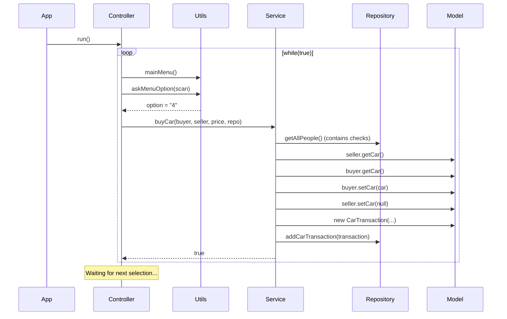

# masterDoc v2

## Summary

> A console-based Java application for managing **Person**, **Car**, and **Dog** entities with support for car transactions between people. The application follows a **Domain-Driven Design (DDD)** structure with separated layers: `controller`, `service`, `repository`, `model`, and `utils`. The application provides a menu-driven interface for CRUD operations and uses an in-memory repository for data storage. The `buyCar` use case is fully implemented.

## Project

- **Name:** PersonCarDog
- **Package:** `org.example`
- **Entry point:** `App.main()`
- **Build:** Maven (`pom.xml`)
- **Version:** 1.0-SNAPSHOT

Project structure (DDD layered architecture):

```
src/
└── main/
    └── java/
        └── org/
            └── example/
                ├── App.java
                ├── controller/
                │   └── Controller.java
                ├── model/
                │   ├── Car.java
                │   ├── CarTransaction.java
                │   ├── Dog.java
                │   └── Person.java
                ├── repository/
                │   └── Repository.java
                ├── service/
                │   └── Service.java
                └── utils/
                    └── Utils.java
```

## DDD Layers

| Layer | Package | Responsibility |
|-------|---------|----------------|
| **Controller** | `controller` | Entry point for user interaction; menu loop, input handling, delegates to Service |
| **Service** | `service` | Business logic and use cases (e.g. `buyCar`) |
| **Repository** | `repository` | In-memory data access (fake database) |
| **Model** | `model` | Domain entities: `Person`, `Car`, `Dog`, `CarTransaction` |
| **Utils** | `utils` | Shared utilities (menu printing, input helpers) |

## Classes

| Class | Fields | Description |
|---|---|---|
| **App** | — | Main class; delegates to `Controller.run()` |
| **Controller** | — | Console menu loop; handles user input and calls Service methods |
| **Service** | — | Business logic; `buyCar(...)` implemented |
| **Repository** | `id`, `people`, `cars`, `dogs`, `carTransactions` | In-memory fake database |
| **Person** | `id`, `name`, `age`, `car` | Represents a person who can own a car |
| **Car** | `id`, `make`, `model`, `year` | Represents a car |
| **Dog** | `id`, `name`, `breed`, `age` | Represents a dog |
| **CarTransaction** | `id`, `buyer`, `seller`, `date`, `car`, `contract` | Records a car sale between two people |
| **Utils** | — | `mainMenu()`, `askMenuOption(Scanner)` |

### Repository — In-Memory Database

`Repository` acts as a **fake database** that simulates persistent storage entirely in memory. Each `ArrayList` field works as a **database table**:

| ArrayList (table) | Stores | Equivalent SQL table |
|---|---|---|
| `people` | `Person` objects | `PERSON` |
| `cars` | `Car` objects | `CAR` |
| `dogs` | `Dog` objects | `DOG` |
| `carTransactions` | `CarTransaction` objects | `CAR_TRANSACTION` |

Each table exposes four CRUD methods following the same pattern:

| Method | SQL equivalent | Description |
|---|---|---|
| `add<Entity>(entity)` | `INSERT` | Appends the object to the list |
| `get<Entity>ById(id)` | `SELECT WHERE id = ?` | Loops through the list and returns the matching object, or `null` |
| `getAll<Entities>()` | `SELECT *` | Returns the entire list |
| `remove<Entity>(id)` | `DELETE WHERE id = ?` | Removes the matching object using `removeIf`, returns `true`/`false` |

> **Limitations:** Data lives only while the application is running — all data is lost when the program stops. There are no indexes, constraints, or relationships enforced at the repository level.

## Implemented Use Cases

| Use Case | Status | Notes |
|----------|--------|-------|
| Person operations | Not implemented | Menu option 1 placeholder |
| Dog operations | Not implemented | Menu option 2 placeholder |
| Car operations | Not implemented | Menu option 3 placeholder |
| **Buy a car (person to person)** | **Implemented** | Menu option 4 → `Service.buyCar(...)` |

### buyCar Implementation

`Service.buyCar(Person buyer, Person seller, int price, Repository repo)` performs the following:

1. Validates buyer exists in repository
2. Validates seller exists in repository
3. Validates seller has a car to sell (`seller.getCar() != null`)
4. Validates buyer does not already own a car (`buyer.getCar() == null`)
5. Transfers ownership:
   - `buyer.setCar(car)`
   - `seller.setCar(null)`
6. Creates a `CarTransaction` with contract text including price
7. Persists transaction via `repo.addCarTransaction(transaction)`
8. Returns `true` on success, `false` on any validation failure

Execution flow (from user selecting option 4):

```
App.main()
  └── Controller.run()
        └── while(true)
              ├── Utils.mainMenu()
              ├── Utils.askMenuOption(scan)
              └── option == "4"
                    └── Service.buyCar(buyer, seller, price, repo)
                          ├── validate buyer/seller in repo
                          ├── validate seller has car
                          ├── validate buyer has no car
                          ├── transfer ownership
                          ├── create CarTransaction
                          └── repo.addCarTransaction(...)
```

## UML

### Domain Model

```
┌─────────────────┐       ┌─────────────────┐
│    Person       │       │     Car         │
├─────────────────┤       ├─────────────────┤
│ - id: String    │       │ - id: String    │
│ - name: String  │       │ - make: String  │
│ - age: int      │       │ - model: String │
│ - car: Car      │──────>│ - year: int     │
└──────┬──────────┘       └─────────────────┘
       │
       │ buyer / seller
       ▼
┌─────────────────────┐
│   CarTransaction    │
├─────────────────────┤
│ - id: String        │
│ - buyer: Person     │
│ - seller: Person    │
│ - date: Date        │
│ - car: Car          │──────> Car
│ - contract: String  │
└─────────────────────┘

┌─────────────────┐
│     Dog         │
├─────────────────┤
│ - id: String    │
│ - name: String  │
│ - breed: String │
│ - age: int      │
└─────────────────┘
```

### Layer Responsibilities (DDD)

```
┌──────────────┐
│     App      │
├──────────────┤
│ + main()     │
└──────┬───────┘
       │
       ▼
┌─────────────────────┐
│     Controller      │
├─────────────────────┤
│ + run()             │
│ + menu loop         │
│ delegates to Service│
└──────┬──────────────┘
       │
       ▼
┌─────────────────────┐       ┌─────────────────────────┐
│      Service        │       │     Repository          │
├─────────────────────┤       ├─────────────────────────┤
│ + buyCar(...)       │──────>│ - people: List<Person>  │
│   (implemented)     │       │ - cars: List<Car>       │
└─────────────────────┘       │ - dogs: List<Dog>       │
                              │ - carTransactions:      │
                              │   List<CarTransaction>  │
                              ├─────────────────────────┤
                              │ + add/get/remove        │
                              │   for each entity       │
                              └─────────────────────────┘
```

### Sequence — buyCar (Successful Path)



## Tech Stack

- **Language:** Java 21
- **Build tool:** Maven (no dependencies)
- **Testing:** JUnit 3.8.1
- **Data storage:** In-memory (ArrayList)
- **UI:** Console (Scanner)
- **IDE:** IntelliJ IDEA 2026.2.3
